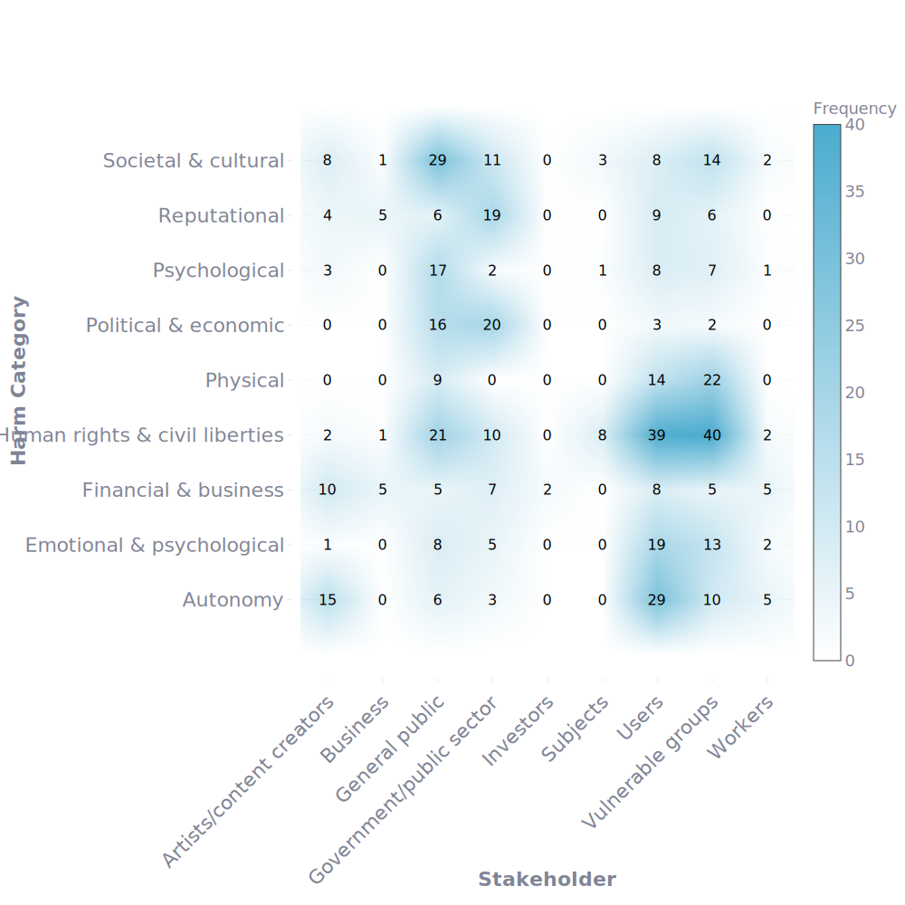

# AI Harmonics

A human-centric, harm-severity-adaptive framework for AI risk assessment.  
This repository contains the **Streamlit** apps and supporting code for the paper:

 **AI Harmonics: a human-centric and harms severity-adaptive AI risks assessment framework**  
 Sofia Vei, Paolo Giudici, Pavlos Sermpezis, Athena Vakali, Adelaide Berardinelli (2025).  

---

## Overview

Contemporary AI risk assessments often rely on internal, compliance-driven checklists that overlook the lived experiences of those harmed by deployed AI systems. **AI Harmonics** shifts this paradigm by:

1. **Embedding human perspectives**  
   - Leverages 816 expert-annotated real-world AI incident reports (AIAAIC dataset)  
   - Captures harms across **Categories**, **Subcategories** and **Stakeholder** groups  

2. **Ordinal, data-driven prioritization**  
   - Introduces the **AI Harmonics (AIH)** metric: an ordinal “pseudo-Gini” measuring how concentrated harms are among the most affected  
   - Benchmarks against the **Criticality Index (CI)** to validate ordinal consistency  

3. **Robust, adaptive analysis**  
   - Sensitivity studies under random severity permutations and annotation removal  
   - Boundary analysis for extreme “best-case”/“worst-case” harm concentration  

---

---

## Data

- **AIAAIC dataset**  
  - 816 expert-annotated AI incidents (March–April 2024)  
  - Mapped to:
    - **Harm Categories** & **Subcategories**  
    - **Stakeholder** groups (e.g., Users, Vulnerable Groups, Businesses…)  

- **Processed CSVs**  
  - In `data/` → `results/`:  
    - Frequencies of each `(category, stakeholder)` pair
      

  
   
  <em>Figure 1. AI incidents by harm category and stakeholder group.</em>

    - Ready for metric computation and visualization  

---

## Metrics

### AI Harmonics (AIH)

An ordinal “pseudo-Gini” measuring how harms in category _i_ concentrate among the most severely affected stakeholders.  
Higher AIH ⇒ stricter concentration ⇒ higher mitigation priority.

  <kbd>
    <pre>
AIH_i = ∫₀¹ ℓ_i(x) dx
    </pre>
  </kbd>

### Criticality Index (CI)

A benchmark ordinal metric (mean of cumulative ranks).  
Under purely ordinal inputs, CI and AIH are provably **linearly aligned**, providing mutual validation.

---
